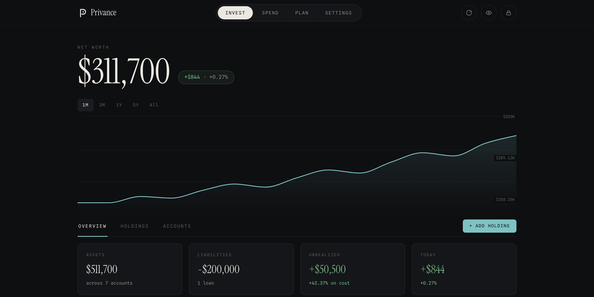

<p align="center">
  
</p>

<h1 align="center">Privance</h1>

<p align="center">
  <em>Personal finance, kept personal.</em>
</p>

<p align="center">
  <a href="LICENSE"></a>
  
  
</p>

<p align="center">
  
</p>

Privance is a command center for your money: net worth, holdings, spending, and a financial independence planner. Everything is encrypted in your browser before it leaves. The server, ours or yours, stores that encrypted data but never the keys to unlock it. Even if it were breached, all anyone would find is your username and some timestamps. Not your balances, not your investments, not a single dollar.

> [!WARNING]
> **No backdoor, by design.** There are no resets, no recovery email, no master key in a drawer. Lose both your master password and your 12-word recovery phrase and the data is gone for good, even to a hosted-instance operator. Keep the phrase on paper, offline.

## Inside the vault

- **Net worth, honestly computed.** Assets minus liabilities across cash, brokerage, retirement, property, and crypto, tracked on a daily trend and calculated to the exact cent.
- **Holdings, priced live.** Stocks, funds, and crypto with fractional shares and your real cost basis. Price lookups go out anonymously, never tied to you.
- **Allocation and insights.** Your mix by asset class and sector, how much rides on any single holding, and where every dollar sits by tax treatment.
- **Spending you're committed to.** Bills and subscriptions, essentials and discretionary, logged by hand. No bank linking; the server never learns where the money went.
- **Independence, simulated.** Project your path to financial independence with thousands of Monte Carlo runs and real historical-market replays, all on your own device.
- **Face, fingerprint, phrase.** Unlock with a passkey on the devices you trust. After a stretch of inactivity the app locks itself and clears your keys from memory.
- **The veil.** One tap frosts every figure on screen. Charts stay readable, numbers don't.
- **Installs from the browser.** A progressive web app that works offline on desktop and phone. No app store in the way.

## How the server stays blind

Your privacy isn't a setting or a promise; it's built into how the encryption works, and all of it happens in your browser:

1. **Stretch.** Your master password is put through Argon2id, a deliberately slow step that makes it impractical to guess.
2. **Split.** From it, two separate keys are created: one proves who you are to the server, the other encrypts your data and never leaves your device.
3. **Seal.** Every record is locked with AES-256-GCM and bound to its place, so nothing can be swapped out or tampered with.

| The server holds | The server never holds |
| --- | --- |
| login proof | your password |
| encrypted data | your encryption keys |
| timestamps | a single balance |

The code is open and the cryptography is standard, so you never have to take our word for it. Audit it, fork it, run it.

## Try it

- **Hosted.** Sign up at [privance.app](https://privance.app). We run the servers and keep the backups; everything we store is encrypted, and we hold no key to read it.
- **Local, one command.** Build and run the whole stack on your machine:
  ```sh
  git clone https://github.com/rahulkrishnan1/privance.git
  cd privance
  docker compose -f infra/compose.local.yaml up --build
  ```
  Open `http://localhost:8080` and create an account. This runs over plain HTTP with a throwaway password and a fixed dev secret, for evaluation only, so never expose it to a network. Tear it down with `docker compose -f infra/compose.local.yaml down -v`.

## Self-host

One server container, one Postgres, one Caddy for automatic TLS. A small VPS or even a Raspberry Pi will do. Public images ship from GHCR (`ghcr.io/rahulkrishnan1/privance-{server,web,restic-runner}`), so there is nothing to build; bring a Linux host with Docker and a domain with A + AAAA records.

The full procedure (TLS, secrets, encrypted offsite backups, invite-only signup) is in [`infra/README.md`](infra/README.md); the rationale is in [`docs/adr/0002-deployment.md`](docs/adr/0002-deployment.md).

## Development

```sh
git clone https://github.com/rahulkrishnan1/privance.git
cd privance
pnpm install
cp server/.env.example server/.env   # set ENUMERATION_SECRET: openssl rand -base64 48
pnpm --filter @privance/server db:migrate
pnpm dev                             # web on :8081, server on :3000
```

Needs Bun >= 1.3.14, Node.js >= 22, pnpm >= 11, and Postgres 17. The full setup, test, and lint workflow is in [CONTRIBUTING.md](CONTRIBUTING.md).

```
apps/web/      Next.js 16 PWA (React, Tailwind, static export)
packages/core/ Pure TypeScript: crypto, decimal math, sync, storage
server/        Bun + Hono + Drizzle + Postgres
infra/         Compose stack, deploy procedure, env templates
```

## Architecture and security

[ARCHITECTURE.md](ARCHITECTURE.md) maps the modules and data flow. [SECURITY.md](SECURITY.md) lists the guaranteed properties and [THREAT_MODEL.md](THREAT_MODEL.md) the full STRIDE analysis. Found a vulnerability? Email security@privance.app, and please do not open a public issue.

## License

[AGPL-3.0](LICENSE). Built in the open. No analytics, no trackers.
